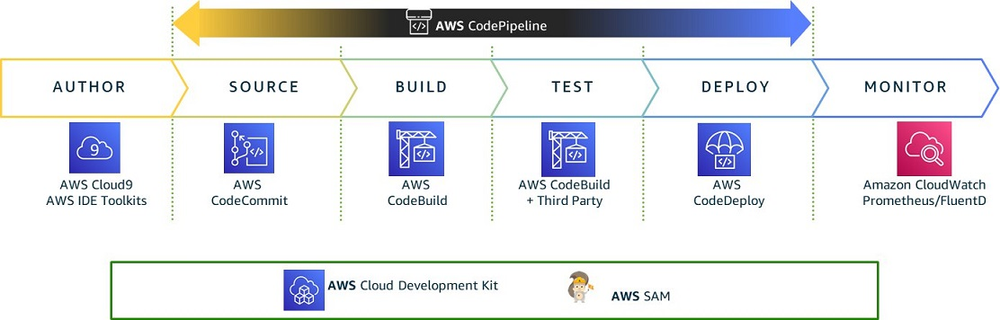
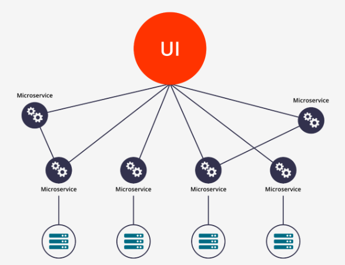
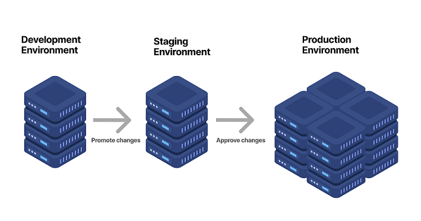
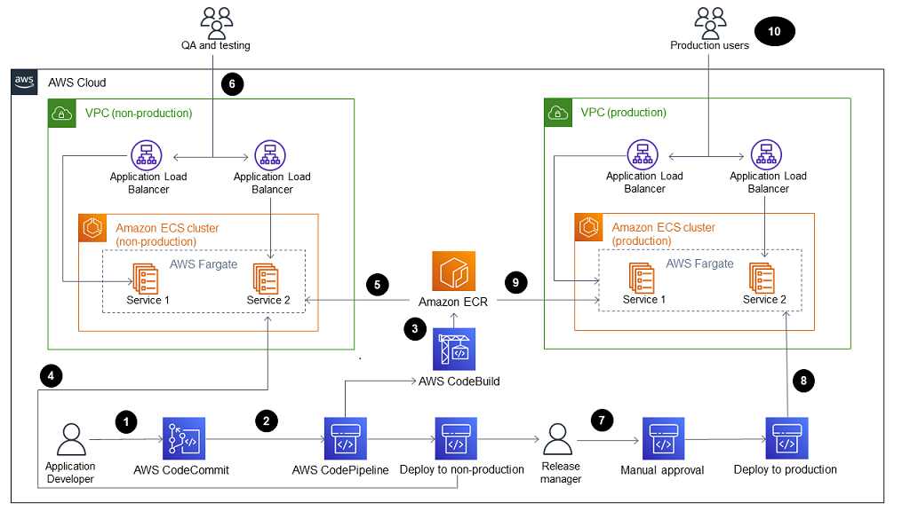
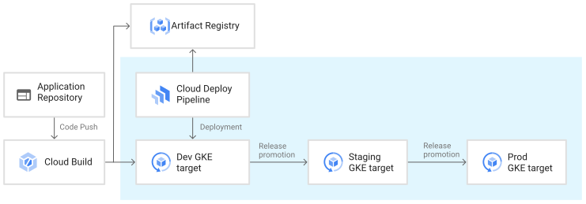
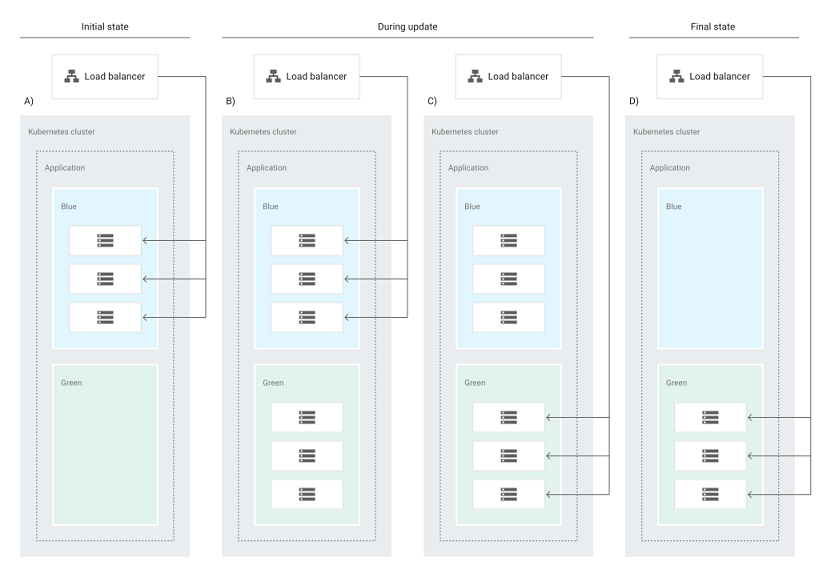
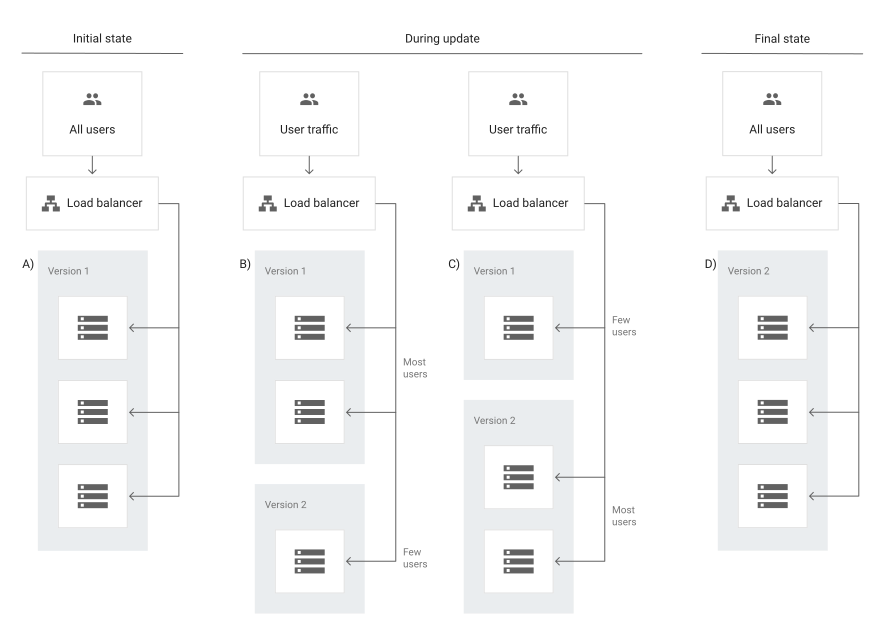
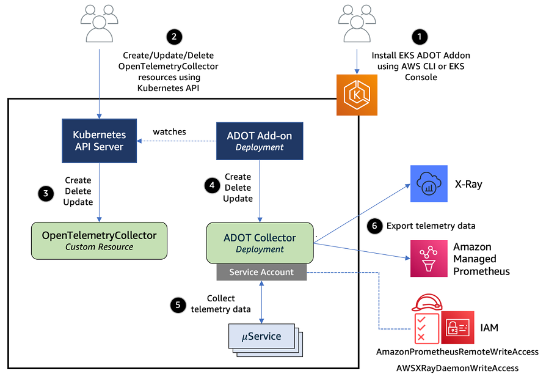
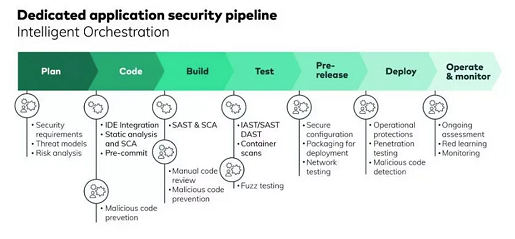

 

  <h1 align="center">CI/CD Strategy for Microservices-Based Application</h1>

  

    This document presents a strategy for implementing Continuous Integration/Continuous Deployment (CI/CD) pipelines for a microservices-based application across multiple environments: development (dev), staging, and production.
     
     
  

## Table of Contents
- [Introduction](#introduction)
- [CI/CD Overview](#cicd-overview)
- [Interdependent Microservices Architecture](#inter-dependent-microservices-architecture)
- [Multiple Environments](#multiple-environments)
- [CI/CD Pipeline Design](#cicd-pipeline-design)
- [Environment Promotion](#environment-promotion)
- [Monitoring and Observability](#monitoring-and-observability)
- [Security Considerations](#security-considerations)
- [Conclusion](#conclusion)

## Introduction
In a microservices architecture, the application is composed of multiple services, each serving a specific function. These services often have dependencies on each other and require careful coordination to ensure they work together seamlessly. 

Implementing CI/CD pipelines in such a scenario can be complex due to the need for managing and coordinating deployments across multiple services and environments. This document outlines a strategy to tackle these challenges.

## CI/CD Overview
Continuous Integration (CI) is a development practice where developers integrate code into a shared repository frequently. Each integration can then be verified by an automated build and automated tests.

Continuous Deployment (CD) is a software release process in which development changes are automatically prepared for a release to production.

CI/CD pipelines aim to establish a consistent and automated way to build, package, and test applications. With consistency in the integration process in place, teams are more likely to commit code changes more frequently, leading to better collaboration and software quality.

A simple CI/CD architecture on AWS:\
 

## Inter-dependent Microservices Architecture
In a microservices architecture, each service should have its own CI/CD pipeline. This allows each service to be developed, tested, and deployed independently of the others. This is crucial for ensuring that teams can work autonomously without being blocked by changes in other services.

Each service's pipeline should include:

- **Building the Service:** This includes compiling the code, running Static Application Security Testing (SAST) & unit tests, and building Docker images. Each image should be tagged uniquely, preferably with the Git commit hash, to ensure an accurate version history.

- **Testing the Service:** This can include running integration tests, end-to-end tests, and any other necessary tests. These tests should be designed to ensure that the service can work correctly with other services in the system.

- **Deploying the Service:** This involves deploying the service to a specific environment. This could be a development, staging, or production environment, depending on the stage of the pipeline.

A Microservices architecture, dependent on each other:\
 

## Multiple Environments
Maintaining separate environments for development, staging, and production is a best practice. Each environment should have its own version of the application, infrastructure, and configuration.

- **Development Environment:** This is where developers test their changes before committing them. It's typically configured to be as close as possible to the production environment to ensure consistency.

- **Staging Environment:** This is a replica of the production environment used to test the application in a production-like setting before it's actually released to production.

- **Production Environment:** This is where the live application runs. It's crucial to ensure that deployments to this environment are reliable and error-free.

Each environment should have its own configuration settings, such as database connection strings, API keys, and other environment-specific variables. These should be stored securely and injected into the application at runtime. 

A multi environment release strategy:\

## CI/CD Pipeline Design
The CI/CD pipeline for each microservice should be designed to support multiple environments and ensure that the application is thoroughly tested before it's deployed to production. 

A typical pipeline might look like this:

1. **Code Commit:** Developers commit their code changes to the repository. 

2. **Build Stage:** The pipeline automatically triggers a build when new commits are pushed to the repository. This includes compiling the code, running SAST & unit tests, and building Docker images. 

3. **Integration Tests:** After the build completes, the pipeline deploys the application to a test environment and runs integration tests.

4. **Staging Deployment:** If the integration tests pass, the pipeline deploys the application to the staging environment.

5. **End-to-End Tests:** In the staging environment, the pipeline runs end-to-end tests to ensure the application works correctly in a production-like setting.

6. **Production Deployment:** If the end-to-end tests pass, the pipeline deploys the application to the production environment. Deployments to production should be done in a controlled manner, using strategies like blue/green deployments or canary releases to minimize the impact of any issues.

7. **Monitoring & Alerting:** After deployment, the pipeline monitors the application's performance and alerts the team if any issues are detected. This could involve integration with a monitoring system like AWS CloudWatch and a log aggregation system like AWS CloudWatch Logs.

Diagram on how to handle CI/CD for microservice based architecture on AWS, involving multiple environment:\

## Environment Promotion
Promotion between environments ensures that the exact same artifact (Docker image) that was tested in the previous environments is what gets deployed to production. \
A simple environment promotion for multipe kubernetes environment in Google Cloud may look like this.\

- **From Development to Staging:** Promotion from the development to the staging environment should be triggered after all tests in the development environment have passed successfully. This transition can be managed through a Git-based workflow where code changes are merged from the development branch to the staging branch, triggering the staging pipeline.

- **From Staging to Production:** Promotion to production should occur after successful validation in the staging environment. This could involve manual approval for added safety. Similar to the development-to-staging promotion, this can be managed through a Git workflow where changes are merged from the staging branch to the main branch, triggering the production pipeline.

    - **Deployment Strategies:** Deploying applications to production is a sensitive step that requires careful consideration to ensure minimal disruption to end users. Here are a few strategies:

        - **Blue/Green Deployment:** In a blue/green deployment, two environments (the blue and the green) are maintained. At any given time, one of them (let's say blue) is live and serving production traffic, while the other (green) is idle. When a new version of the application is ready to be deployed, it is deployed to the idle environment (green). After testing, the production traffic is switched (via a load balancer or a service mesh) from the blue environment to the green environment. If any issues are discovered after the switch, you can roll back quickly by switching the traffic back to the blue environment.

            

        - **Canary Deployment:** In a canary deployment, the new version of the application is gradually rolled out to a small percentage of users before it is rolled out to everyone. The advantage of this approach is that if the new version introduces issues, those issues only affect a small number of users. Canary deployments can be implemented with the help of a service mesh or a feature of the container orchestration platform.

            

## Monitoring and Observability
Monitoring and observability should be an integral part of the CI/CD pipelines. 

- **Application Monitoring:** Use tools like AWS CloudWatch to monitor application performance and set up alerts for any anomalies.

- **Log Aggregation:** Centralize logs using services like AWS CloudWatch Logs to make it easier to trace errors and understand application behavior.

- **Distributed Tracing:** Implement distributed tracing using tools like AWS X-Ray to understand how requests flow through your microservices.

- **Error Tracking:** Use error tracking tools to capture errors in real time.

- In addition, the use of **OpenTelemetry** for distributed tracing can significantly improve the security posture. Distributed tracing provides visibility into the interactions between services in a microservices architecture. This can help in identifying unusual patterns of behavior, such as unexpected communication between services, unusually high latency, etc. These could be indicators of a security incident and can provide valuable context for incident response and forensics.

    Here is how OpenTelemetry can be implemeted for EKS clusters running on AWS:\
    

## Security Considerations
Security should be built into every stage of the CI/CD pipeline.

- **Access Control:** Use IAM roles and policies to enforce the principle of least privilege. Each service should only have the permissions it needs to function, and no more.

- **Secret Management:** Use services like AWS Secrets Manager to store and manage sensitive information like database passwords and API keys.

- **Vulnerability Scanning:** Regularly scan your application and infrastructure for vulnerabilities. AWS provides several security services like AWS Inspector for this purpose.

- **Image Scanning:** Scan Docker images for vulnerabilities before deploying them.

- **Network Policies:** Use network policies to control traffic between your services and block unauthorized access.

- **Immutable Infrastructure:** By using containerized applications and declarative infrastructure as code, you can ensure that your environments are reproducible, scalable, and consistent.

- **Compliance Checks:** Incorporate automated compliance checks into your pipeline to ensure your application meets necessary regulatory standards.

A CI/CD pipeline incorporating security checks:\

## Conclusion
Implementing CI/CD for a microservices-based application that supports multiple environments can be complex, but with the right approach and tools, it's achievable and beneficial. This strategy provides a robust framework for building, testing, and deploying microservices across multiple environments with an emphasis on automation, testing, and security.