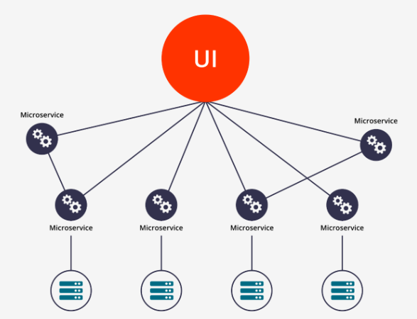
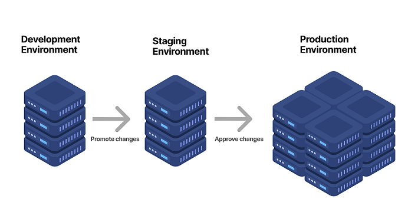
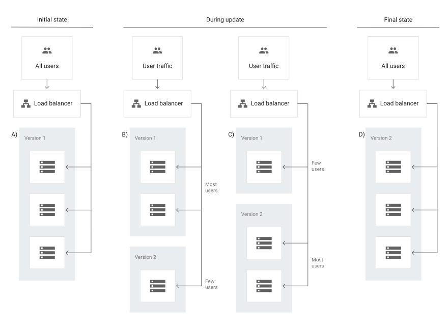
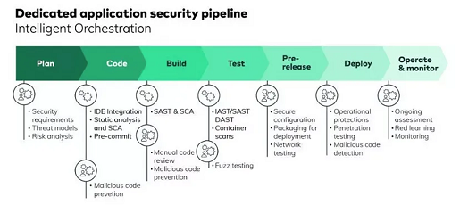

 

  <h1 align="center">マイクロサービスベースのアプリケーション用のCI/CD戦略</h1>

  

    このドキュメントでは、開発（dev）、ステージング、および本番の複数の環境でマイクロサービスベースのアプリケーション用の継続的インテグレーション/継続的デプロイメント（CI/CD）パイプラインを実装する戦略を説明します。
     
     
  

## 目次
- [はじめに](#introduction)
- [CI/CDの概要](#cicd-overview)
- [相互依存するマイクロサービスアーキテクチャ](#inter-dependent-microservices-architecture)
- [複数の環境](#multiple-environments)
- [CI/CDパイプライン設計](#cicd-pipeline-design)
- [環境プロモーション](#environment-promotion)
- [モニタリングと観測性](#monitoring-and-observability)
- [セキュリティの考慮事項](#security-considerations)
- [結論](#conclusion)

## はじめに
マイクロサービスアーキテクチャでは、アプリケーションは多数のサービスで構成され、それぞれが特定の機能を提供します。これらのサービスはしばしば相互に依存しており、シームレスに連携できるように慎重な調整が必要です。

複数のサービスと環境間でのデプロイを管理・調整する必要があるため、このようなシナリオではCI/CDパイプラインの実装が複雑になります。このドキュメントでは、これらの課題に取り組むための戦略を概説します。

## CI/CDの概要
継続的インテグレーション（CI）は、開発者が頻繁にコードを共有リポジトリに統合する開発手法です。各統合は、自動ビルドと自動テストによって検証することができます。

継続的デプロイメント（CD）は、開発の変更が自動的に本番リリースに備えて準備されるソフトウェアリリースプロセスです。

CI/CDパイプラインの目的は、アプリケーションのビルド、パッケージ化、テストを一貫して自動化することです。統合プロセスに一貫性があると、チームはより頻繁にコードの変更をコミットする可能性が高くなり、より良い協力とソフトウェア品質が得られます。

AWSでのシンプルなCI/CDアーキテクチャ:\
 

## 相互依存するマイクロサービスアーキテクチャ
マイクロサービスアーキテクチャでは、各サービスは独自のCI/CDパイプラインを持つべきです。これにより、各サービスを他のサービスから独立して開発、テスト、デプロイすることができます。これは、チームが他のサービスの変更にブロックされることなく自律的に作業できることを保証するために重要です。

それぞれのサービスのパイプラインには次のものが含まれるべきです:

- **サービスのビルド:** これには、コードのコンパイル、Static Application Security Testing (SAST)とユニットテストの実行、Dockerイメージのビルドが含まれます。各イメージは、Gitコミットハッシュを使用してユニークにタグ付けされ、正確なバージョン履歴を保証するべきです。

- **サービスのテスト:** これには、統合テスト、エンドツーエンドテスト、その他必要なテストの実行が含まれることができます。これらのテストは、サービスがシステム内の他のサービスと正確に連携できることを確認するように設計されるべきです。

- **サービスのデプロイ:** これは、特定の環境にサービスをデプロイすることを含みます。これは開発環境、ステージング環境、または本番環境になることができ、パイプラインの段階によります。

相互に依存するマイクロサービスアーキテクチャ:\
 

## 複数の環境
開発、ステージング、本番の各環境を保持することはベストプラクティスです。各環境は、自身のアプリケーション、インフラストラクチャ、設定のバージョンを持つべきです。

- **開発環境:** ここでは、開発者がコミットする前に自分の変更をテストします。通常、一貫性を保証するために、本番環境に可能な限り近い設定になっています。

- **ステージング環境:** これは、実際に本番環境にリリースする前に、本番環境のような設定でアプリケーションをテストするための本番環境のレプリカです。

- **本番環境:** ここでライブアプリケーションが稼働します。この環境へのデプロイは信頼性があり、エラーフリーであることが重要です。

各環境は、データベース接続文字列、APIキー、その他の環境固有の変数など、独自の設定設定を持つべきです。これらは安全に保管され、ランタイム時にアプリケーションに注入されるべきです。 

マルチ環境リリース戦略:\

## CI/CDパイプライン設計
各マイクロサービスのCI/CDパイプラインは、複数の環境をサポートし、アプリケーションが本番環境にデプロイされる前に徹底的にテストされることを確保するように設計するべきです。 

典型的なパイプラインは次のようになります:

1. **コードコミット:** 開発者はリポジトリにコード変更をコミットします。

2. **ビルドステージ:** 新しいコミットがリポジトリにプッシュされると、パイプラインは自動的にビルドをトリガーします。これには、コードのコンパイル、SASTとユニットテストの実行、Dockerイメージのビルドが含まれます。

3. **統合テスト:** ビルドが完了すると、パイプラインはアプリケーションをテスト環境にデプロイし、統合テストを実行します。

4. **ステージングデプロイメント:** 統合テストがパスすると、パイプラインはアプリケーションをステージング環境にデプロイします。

5. **エンドツーエンドテスト:** ステージング環境では、パイプラインがエンドツーエンドテストを実行して、アプリケーションが本番環境と同様の設定で正しく動作することを確認します。

6. **本番環境へのデプロイメント:** エンドツーエンドテストがパスすると、パイプラインはアプリケーションを本番環境にデプロイします。本番環境へのデプロイは、問題の影響を最小限に抑えるために、ブルー/グリーンデプロイやカナリアリリースなどの戦略を使用して制御された方法で行うべきです。

7. **モニタリングとアラート:** デプロイ後、パイプラインはアプリケーションのパフォーマンスを監視し、問題が検出された場合はチームにアラートを送ります。これには、AWS CloudWatchのような監視システムと、AWS CloudWatch Logsのようなログ集約システムとの統合が含まれることがあります。

AWSにおけるマイクロサービスベースのアーキテクチャのCI/CDの取り扱いに関する図:\

## 環境プロモーション
環境間のプロモーションにより、前の環境でテストされた正確な同じアーティファクト（Dockerイメージ）がプロダクションにデプロイされることを保証します。\
Google Cloudの複数のKubernetes環境のシンプルな環境プロモーションはこのようになります。\

- **開発からステージングへ:** 開発環境のすべてのテストが成功した後に、開発からステージング環境へのプロモーションをトリガーする必要があります。この遷移は、開発ブランチからステージングブランチへのコード変更がマージされ、ステージングパイプラインがトリガーされる、Gitベースのワークフローを通じて管理できます。

- **ステージングからプロダクションへ:** ステージング環境での成功した検証の後、プロダクションへのプロモーションが行われるべきです。これは、安全性を強化するための手動の承認を伴うことができます。開発からステージングへのプロモーションと同様に、これはステージングブランチからメインブランチへの変更がマージされ、プロダクションパイプラインがトリガーされるGitワークフローを通じて管理できます。

    - **デプロイメント戦略:** プロダクションへのアプリケーションのデプロイは、エンドユーザーへの影響を最小限に抑えるために慎重に考慮する必要がある、敏感なステップです。以下にいくつかの戦略を示します：

        - **ブルー/グリーンデプロイメント:** ブルー/グリーンデプロイメントでは、2つの環境（ブルーとグリーン）が維持されます。いずれかの時間に、1つの環境（ブルーとしましょう）がライブであり、本番トラフィックを提供している一方、もう1つの環境（グリーン）はアイドル状態です。新しいバージョンのアプリケーションがデプロイする準備ができたとき、それはアイドル状態の環境（グリーン）にデプロイされます。テストの後、本番トラフィックは（ロードバランサーやサービスメッシュを介して）ブルー環境からグリーン環境に切り替えられます。切り替え後に問題が発見された場合、トラフィックをブルー環境にすばやく切り替えることでロールバックできます。

            

        - **カナリーデプロイメント:** カナリーデプロイメントでは、新しいバージョンのアプリケーションが全体にロールアウトされる前に、ユーザーの一部に徐々にロールアウトされます。このアプローチの利点は、新しいバージョンが問題を導入した場合、それらの問題は一部のユーザーにのみ影響を与えるということです。カナリーデプロイメントは、サービスメッシュやコンテナオーケストレーションプラットフォームの機能を利用して実装できます。

            

## モニタリングと観察可能性
モニタリングと観察可能性は、CI/CDパイプラインの不可欠な部分であるべきです。

- **アプリケーションモニタリング:** AWS CloudWatchのようなツールを使用してアプリケーションのパフォーマンスを監視し、異常に対してアラートを設定します。

- **ログ集約:** AWS CloudWatch Logsのようなサービスを使用してログを集約し、エラーの追跡を容易にし、アプリケーションの振る舞いを理解します。

- **分散トレーシング:** AWS X-Rayのようなツールを使用して分散トレーシングを実装し、リクエストがマイクロサービスを通過する方法を理解します。

- **エラートラッキング:** リアルタイムでエラーをキャプチャするためのエラートラッキングツールを使用します。

- さらに、**OpenTelemetry**を使用した分散トレーシングは、セキュリティ体制を大幅に改善することができます。分散トレーシングは、マイクロサービスアーキテクチャ内のサービス間の相互作用の可視性を提供します。これにより、サービス間の予期しない通信、異常に高いレイテンシなど、通常の動作パターンの特定が可能になります。これらはセキュリティインシデントの指標であり、インシデント対応とフォレンジックのための貴重なコンテキストを提供することができます。

    AWSで稼働するEKSクラスターにOpenTelemetryを実装する方法はこうです：\
    

## セキュリティに関する考慮事項
セキュリティは、CI/CDパイプラインの各ステージに組み込まれるべきです。

- **アクセス制御:** IAMロールとポリシーを使用して、最小権限の原則を強制します。各サービスは、機能を果たすために必要な権限のみを持つべきです。

- **シークレット管理:** AWS Secrets Managerのようなサービスを使用して、データベースのパスワードやAPIキーなどの機密情報を保存し、管理します。

- **脆弱性スキャン:** アプリケーションとインフラストラクチャを定期的にスキャンして脆弱性を探します。AWSはこの目的のために、AWS Inspectorのようないくつかのセキュリティサービスを提供しています。

- **イメージスキャン:** デプロイする前にDockerイメージを脆弱性スキャンします。

- **ネットワークポリシー:** ネットワークポリシーを使用して、サービス間のトラフィックを制御し、不許可のアクセスをブロックします。

- **イミュータブルなインフラストラクチャ:** コンテナ化されたアプリケーションと宣言的なインフラストラクチャコードを使用することで、環境が再現可能で、スケーラブルで、一貫性が保たれていることを保証します。

- **コンプライアンスチェック:** パイプラインに自動コンプライアンスチェックを組み込むことで、アプリケーションが必要な規制基準を満たしていることを確保します。

セキュリティチェックを組み込んだCI/CDパイプライン:\

## 結論
マルチ環境をサポートするマイクロサービスベースのアプリケーションのCI/CDを実装することは複雑ですが、適切なアプローチとツールを用いれば、達成可能であり、有益です。この戦略は、自動化、テスト、セキュリティを重視したマルチ環境でのマイクロサービスのビルド、テスト、デプロイのための堅牢なフレームワークを提供します。
<end>